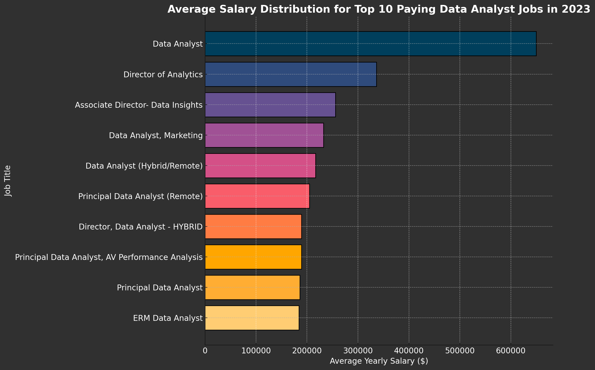
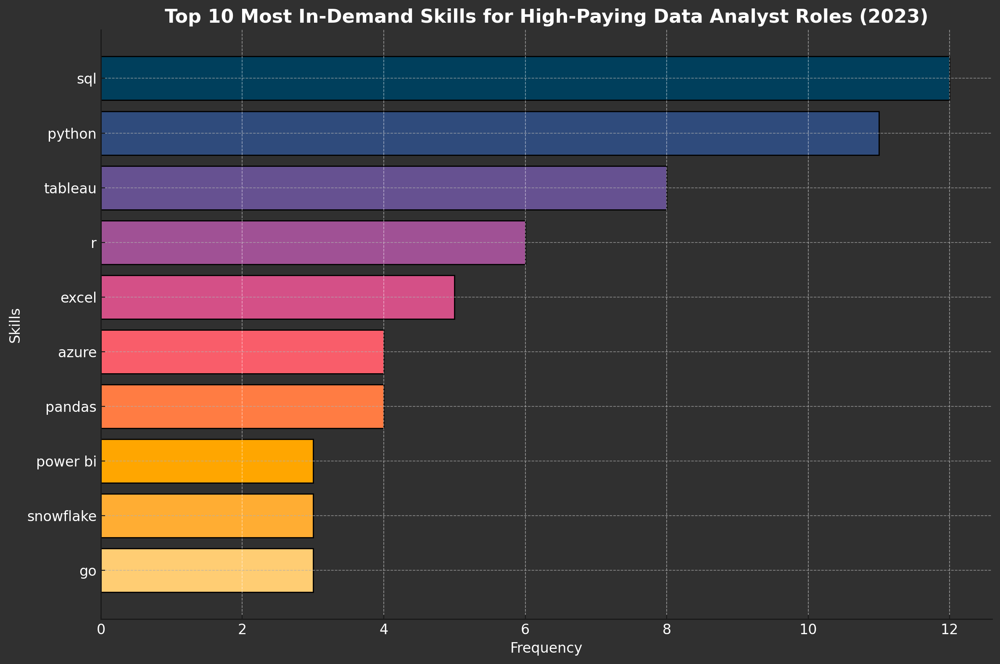

# Introduction
🌟 Explore the data job market!
This project focuses on data analyst roles, uncovering 💰 high-paying opportunities, 🔥 in-demand skills, and 📊 the intersection of high demand and lucrative salaries in the field of data analytics.

🔍 Interested in SQL queries? Check them out here: [project_section folder](/project_section/)

# Background
This project aims to streamline the job search process in the data analytics field by identifying top-paying and in-demand skills. Born out of a need to navigate the data analyst job market more efficiently, it serves as a guide to finding optimal career opportunities.


### Questions Addressed Through SQL Queries:
- Which data analyst jobs offer the highest salaries?
- What skills are essential for these high-paying roles?
- Which skills are most in demand for data analysts?
- What skills are linked to higher salary brackets?
- Which skills are the most valuable to learn for career optimization?

# Tools Used
To delve into the data analyst job market, I leveraged several key tools:

- **SQL:** The core of my analysis, enabling me to query the database and extract valuable insights.
- **PostgreSQL:** The database management system used for handling job posting data efficiently.
- **Visual Studio Code:** My preferred tool for managing databases and executing SQL queries.
- **Git & GitHub:** Crucial for version control and sharing SQL scripts and analyses, ensuring seamless collaboration and project tracking.

# The Analysis
Each query in this project was designed to explore specific aspects of the data analyst job market. Here's how I addressed each question:

### 1. Identifying Top-Paying Data Analyst Jobs
To pinpoint the highest-paying roles, I filtered data analyst positions based on average annual salary and location, with a particular focus on remote jobs. This query highlights the most lucrative opportunities in the field.

```sql
SELECT
    job_id,
    job_title,
    job_location,
    job_schedule_type,
    salary_year_avg,
    job_posted_date,
    name AS company_name
FROM job_postings_fact
LEFT JOIN company_dim
    ON job_postings_fact.company_id = company_dim.company_id
WHERE job_title_short = 'Data Analyst' AND 
      job_location = 'Anywhere' AND
      salary_year_avg IS NOT NULL
ORDER BY salary_year_avg DESC
LIMIT 15;
```
Breakdown of Top Data Analyst Jobs in 2023
- **Wide Salary Range:** The top 10 highest-paying data analyst roles offer salaries ranging from $184,000 to $650,000, showcasing significant earning potential in the field.
- **Diverse Employers:** High-paying roles are offered by companies such as SmartAsset, Meta, and AT&T, reflecting strong demand across various industries.
- **Job Title Variety:** A broad spectrum of job titles exists, ranging from Data Analyst to Director of Analytics, highlighting the diversity of roles and specializations within data analytics.


*This bar chart displays the top 10 salaries for data analysts, visualized based on SQL query results.*

### 2. Skills for Top-Paying Jobs
To uncover the skills required for high-paying roles, I combined job postings with skills data. This analysis provides insights into the attributes employers prioritize for high-compensation positions.

```sql
WITH top_paying_jobs AS(
    SELECT
        job_id,
        job_title,
        salary_year_avg,
        name AS company_name
    FROM job_postings_fact
    LEFT JOIN company_dim
        ON job_postings_fact.company_id = company_dim.company_id
    WHERE job_title_short = 'Data Analyst' AND 
          job_location = 'Anywhere' AND
          salary_year_avg IS NOT NULL
    ORDER BY salary_year_avg DESC
    LIMIT 15
)

SELECT top_paying_jobs.* , skills_dim.skills
FROM top_paying_jobs
INNER JOIN skills_job_dim ON top_paying_jobs.job_id = skills_job_dim.job_id
INNER JOIN skills_dim ON skills_job_dim.skill_id = skills_dim.skill_id
ORDER BY salary_year_avg DESC;
```
Breakdown of Skills Analysis:

- **Top Skills:** SQL (12 mentions), Python (11 mentions), and Tableau (8 mentions) are the most in-demand for high-paying data analyst roles.
- **Key Tools:** R, Excel, Azure, and Pandas are frequently mentioned, reflecting their importance in analytics, reporting, and cloud/data processing.
- **Emerging Technologies:** Databricks, AWS, and Pyspark highlight the growing need for cloud and big data expertise.


*The chart visualizes the Top 10 Most In-Demand Skills for High-Paying Data Analyst Roles in 2023 based on their frequency of appearance in job postings*

### 3. Most In-Demand Skills for Data Analysts
This query identified the most commonly requested skills in job postings, emphasizing areas with significant demand.

```sql
WITH remote_job_skills AS (
SELECT skill_id, COUNT(*) AS skill_count
FROM skills_job_dim AS skills_to_job
INNER JOIN job_postings_fact AS job_postings
   ON skills_to_job.job_id=job_postings.job_id
WHERE job_work_from_home = TRUE AND job_title_short = 'Data Analyst'
GROUP BY skill_id
)

SELECT skills.skill_id, skills AS skill_name, skill_count
FROM remote_job_skills
INNER JOIN skills_dim AS skills
    ON skills.skill_id=remote_job_skills.skill_id
ORDER BY skill_count DESC
LIMIT 10;
```
Breakdown of Key Skills in 2023:
- **SQL** and **Excel** remain crucial, highlighting the importance of foundational skills in data processing and spreadsheet manipulation.
- **Programming Languages** and **Visualization Tools** like **Python**, **Tableau**, and **Power BI** are essential, reflecting the growing emphasis on technical proficiency for data storytelling and decision-making.
- Additional skills such as **R**, **SAS**, **Looker**, and **Azure** indicate the increasing demand for statistical modeling, business intelligence, and cloud-based analytics solutions, showcasing the diverse skill set required in the data analytics field.

| Skills     | Demand Count |
|------------|--------------|
| SQL        | 7291         |
| Excel      | 4611         |
| Python     | 4330         |
| Tableau    | 3745         |
| Power BI   | 2609         |
| R          | 2142         |
| SAS        | 933          |
| Looker     | 868          |
| Azure      | 821          |

*Table of the demand for the top 10 skills in data analyst job postings*

### 4. Skills Based on Salary
Exploring the average salaries assosiated with different skills revealed which  skills are the highest-paying

```sql
SELECT skills,
       ROUND(AVG(salary_year_avg), 0) AS avg_salary
FROM job_postings_fact
INNER JOIN skills_job_dim ON job_postings_fact.job_id = skills_job_dim.job_id
INNER JOIN skills_dim ON skills_job_dim.skill_id = skills_dim.skill_id
WHERE job_title_short = 'Data Analyst' AND salary_year_avg IS NOT NULL AND  job_work_from_home = true
GROUP BY skills
ORDER BY avg_salary DESC
LIMIT 10;
```
Key Trends for High-Paying Data Analyst Skills:
- **Big Data & Machine Learning:** Tools like **PySpark** and **DataRobot** emphasize large-scale data processing and predictive modeling for intelligent automation.
- **Cloud & Automation:** The rise of **GCP**, **Kubernetes**, and **Airflow** highlights the shift to cloud-native solutions and workflow automation.
- **Business Intelligence & Collaboration:** BI tools and platforms like **GitLab** and **Bitbucket** support collaborative analytics and streamlined workflows for global teams.

| Skills         | Avg Salary |
|----------------|------------|
| PySpark        | 208,172    |
| Bitbucket      | 189,155    |
| Watson         | 160,515    |
| Couchbase      | 160,515    |
| DataRobot      | 155,486    |
| GitLab         | 154,500    |
| Swift          | 153,750    |
| Jupyter        | 152,777    |
| Pandas         | 151,821    |
| Elasticsearch  | 145,000    |

*Table of average salary for the top 10 paying skills for data analysts*

### 5. Most Optimal Skills to Learn
Combining insights from demand and salary data, this query aimed to pinpoint skills that are both in high demand and have high salaries, offering a strategic focus for skills development

```sql
WITH skills_demand AS (
    SELECT
        skills_dim.skill_id,
        skills_dim.skills,
        COUNT(skills_job_dim.job_id) AS demand_count
    FROM job_postings_fact
    INNER JOIN skills_job_dim ON job_postings_fact.job_id = skills_job_dim.job_id
    INNER JOIN skills_dim ON skills_job_dim.skill_id = skills_dim.skill_id
    WHERE job_title_short = 'Data Analyst'
      AND salary_year_avg IS NOT NULL
    GROUP BY skills_dim.skill_id, skills_dim.skills
),
average_salary AS (
    SELECT
        skills_dim.skill_id,
        ROUND(AVG(salary_year_avg), 0) AS avg_salary
    FROM job_postings_fact
    INNER JOIN skills_job_dim ON job_postings_fact.job_id = skills_job_dim.job_id
    INNER JOIN skills_dim ON skills_job_dim.skill_id = skills_dim.skill_id
    WHERE job_title_short = 'Data Analyst'
      AND salary_year_avg IS NOT NULL
    GROUP BY skills_dim.skill_id
)
SELECT
    skills_demand.skill_id,
    skills_demand.skills,
    skills_demand.demand_count,
    average_salary.avg_salary
FROM skills_demand
INNER JOIN average_salary ON skills_demand.skill_id = average_salary.skill_id
WHERE demand_count > 10
ORDER BY avg_salary DESC, demand_count DESC
LIMIT 25;
```
Key Findings:
- **Most Optimal Skill:**

Spark: With the highest demand (187) and a strong average salary ($113,002), Spark is the most in-demand and well-compensated skill, particularly valuable for big data processing and engineering roles.
- **Other High-Demand, High-Paying Skills:**

Databricks: Demand count of 102 and an average salary of $112,881 make it a crucial skill for cloud-based data analysis and machine learning workflows.
GCP (Google Cloud Platform): Demand count of 78 and an average salary of $113,065 highlight its relevance in cloud computing and big data technologies.
- **Emerging High-Paying Skills:**

Kafka: Though its demand is lower (40), its high average salary ($129,999) makes it an excellent choice for real-time data streaming enthusiasts.
TensorFlow: With an average salary of $120,647, it’s highly relevant for roles in AI and machine learning.

| skill_id | skills      | demand_count | avg_salary |
|----------|-------------|--------------|------------|
| 98       | kafka       | 40           | 129,999    |
| 99       | tensorflow  | 24           | 120,647    |
| 96       | airflow     | 71           | 116,387    |
| 3        | scala       | 59           | 115,480    |
| 169      | linux       | 58           | 114,883    |
| 234      | confluence  | 62           | 114,153    |
| 95       | pyspark     | 49           | 114,058    |
| 81       | gcp         | 78           | 113,065    |
| 92       | spark       | 187          | 113,002    |
| 75       | databricks  | 102          | 112,881    |
| 210      | git         | 74           | 112,250    |

*Table of the most optimal skills for data ananlyst sorted by salary*

# Conclusions

### Insights
- **Top-Paying Data Analyst Jobs:** The highest-paying remote data analyst roles offer a wide salary range, with the top reaching $650,000!
- **Critical Skills for High-Paying Jobs:** Advanced SQL proficiency is key for landing top-paying data analyst roles, making it an essential skill to master.
- **Most In-Demand Skill:** SQL stands out as the most sought-after skill in the data analyst job market, solidifying its importance for job seekers.
- **Skills Linked to Higher Salaries:** Specialized skills like SVN and Solidity command the highest average salaries, highlighting the premium placed on niche expertise.
- **Optimal Skills for Market Value:** With high demand and competitive salaries, SQL remains one of the most valuable skills for data analysts to maximize their marketability.